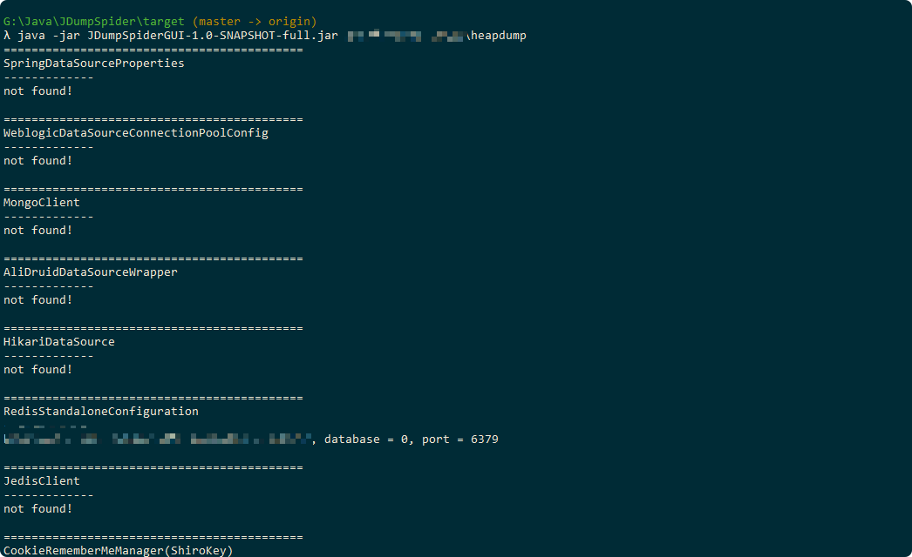
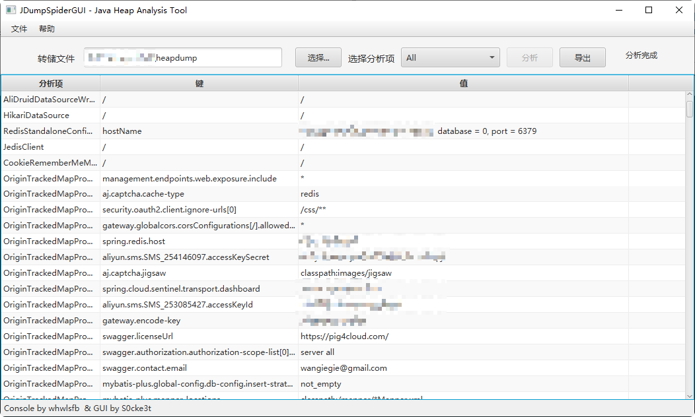

# JDumpSpiderGUI

## 简介
JDumpSpiderGUI 是一个用于 Java 堆转储文件分析的工具，支持命令行和 JavaFX 图形界面两种模式。

- **命令行模式**：适合批量或自动化分析。
- **GUI模式**：基于 JavaFX，支持多项分析结果的可视化浏览和导出。

## 运行环境
- JDK 8（自带 JavaFX）或更高版本（如 JDK 11+ 需自行添加 JavaFX 依赖）

## 启动方式

### 1. 命令行模式
```sh
java -jar JDumpSpiderGUI-1.0-SNAPSHOT-full.jar [参数]
```



### 2. GUI模式

```sh
java -jar JDumpSpiderGUI-1.0-SNAPSHOT-full.jar --gui
```



## 主要功能

- 支持选择转储文件进行分析
- 分析项下拉选择与全部浏览
- 结果表格支持多行选择、右键复制整行/键/值
- 分析进度指示与状态提示
- 结果导出为文本文件

## 依赖
- JavaFX（JDK 8自带，JDK 11+需自行引入）
- 其他依赖见 `pom.xml`

## 编译
需要Maven、JDK 1.8。

首先需要将netbeans-lib-profiler导入本地maven仓库
```
$ cd lib/
$ mvn install:install-file -Dfile=netbeans-lib-profiler.jar -DgroupId=netbeans -DartifactId=netbeans-lib-profiler -Dversion=1.0 -Dpackaging=jar
```
导入完成后切换至项目根目录，运行编译打包命令
```
$ mvn package
```
## 支持范围

暂支持提取以下类型的敏感信息

- 数据源
  - SpringDataSourceProperties
  - WeblogicDataSourceConnectionPoolConfig
  - MongoClient
  - AliDruidDataSourceWrapper
  - HikariDataSource
- 配置文件信息
  - MapPropertySource
  - OriginTrackedMapPropertySource
  - MutablePropertySource
  - ConsulPropertySource
  - OSS（模糊搜索）
- Redis配置
  - RedisStandaloneConfiguration
  - JedisClient
- ShiroKey
  - CookieRememberMeManager
- 模糊搜索用户信息
  - UserPassSearcher01


## 使用

本工具需要使用Java 1.8或更高版本。

```sh
$ java -jar JDumpSpiderGUI-1.0-SNAPSHOT-full.jar                  
Missing required parameter: '<heapfile>'
Usage: JDumpSpider [-hV] <heapfile>                   
Extract sensitive information from heapdump file.     
      <heapfile>   Heap file path.                    
  -h, --help       Show this help message and exit.   
  -V, --version    Print version information and exit.

```

## 贡献

欢迎提交PR或issue，完善功能和界面体验。
---
作者: whwlsfb (Console) & S0cke3t (GUI)

